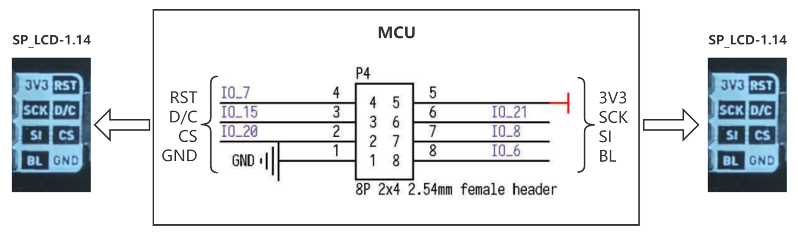

# SP_LCD-1.14 Module User Guide

[中文](README_CN.md)

## Directory Structure

| Directory | Description                                   |
| :-------: | :-------------------------------------------- |
|    doc    | Reference documentation                       |
|    img    | Images                                        |
|  script   | Maixpy script example                         |
|    src    | C program example based on the standalone sdk |

## Introduce

SP_LCD has a 1.14 'inch LCD, 4-line SPI interface control, 8P FPC(0.5mm interval) interface TFT LCD, 180° Angle of view, using SP_MOD connection.

*See [Module Specification](doc/SP-LCD1.14规格书V1.0.pdf) for more information.*

## Pin figure


## Mode of connection



|   MCU:FUN(IO)   | SP_EINK |
| :-------------: | :-----: |
|  GPIOHS7(IO_7)  |   RST   |
| GPIOHS15(IO_15) |   D/C   |
| SPI:SS0(IO_20)  |   CS    |
| SPI:SCK(IO_21)  |   SCK   |
| SPI:MOSI(IO_8)  |   SI    |
|  GPIOHS6(IO_6)  |   BL    |
|    2.5~4.8V     |  3.3V   |
|       GND       |   GND   |

## MCU configuration

### IO port configuration

Configure IO port corresponding to MCU as SPI function pin.

* C

  ```c
  fpioa_set_function(SPI_IPS_LCD_CS_PIN_NUM, FUNC_SPI1_SS0);   // SPI_IPS_LCD_CS_PIN_NUM: 20;
  fpioa_set_function(SPI_IPS_LCD_SCK_PIN_NUM, FUNC_SPI1_SCLK); // SPI_IPS_LCD_SCK_PIN_NUM: 21;
  fpioa_set_function(SPI_IPS_LCD_MOSI_PIN_NUM, FUNC_SPI1_D0);  // SPI_IPS_LCD_MOSI_PIN_NUM: 8;
  fpioa_set_function(SPI_IPS_LCD_DC_PIN_NUM, FUNC_GPIOHS0 + SPI_IPS_LCD_DC_GPIO_NUM);   // SPI_IPS_LCD_DC_PIN_NUM: 15; SPI_IPS_LCD_DC_GPIO_NUM: 15;
  fpioa_set_function(SPI_IPS_LCD_RST_PIN_NUM, FUNC_GPIOHS0 + SPI_IPS_LCD_RST_GPIO_NUM); // SPI_IPS_LCD_RST_PIN_NUM: 7; SPI_IPS_LCD_RST_GPIO_NUM: 7;
  fpioa_set_function(SPI_IPS_LCD_BL_PIN_NUM, FUNC_GPIOHS0 + SPI_IPS_LCD_BL_GPIO_NUM);   // SPI_IPS_LCD_BL_PIN_NUM: 6; SPI_IPS_LCD_BL_GPIO_NUM: 6;
  
  // set gpiohs work mode to output mode
  gpiohs_set_drive_mode(SPI_IPS_LCD_DC_GPIO_NUM, GPIO_DM_OUTPUT);
  gpiohs_set_drive_mode(SPI_IPS_LCD_RST_GPIO_NUM, GPIO_DM_OUTPUT);
  gpiohs_set_drive_mode(SPI_IPS_LCD_BL_GPIO_NUM, GPIO_DM_OUTPUT);
  ```
  
* MaixPy

  ```python
  # 20: SPI_IPS_LCD_SS_PIN_NUM;
  fm.register(20, fm.fpioa.GPIOHS20, force=True)
  # 15: SPI_IPS_LCD_DC_PIN_NUM;
  fm.register(15, fm.fpioa.GPIOHS15, force=True)
  # 6: SPI_IPS_LCD_BUSY_PIN_NUM;
  fm.register(6, fm.fpioa.GPIOHS6, force=True)
  # 7: SPI_IPS_LCD_RST_PIN_NUM;
  fm.register(7, fm.fpioa.GPIOHS7, force=True)
  
  # set gpiohs work mode to output mode
  cs = GPIO(GPIO.GPIOHS20, GPIO.OUT)
  dc = GPIO(GPIO.GPIOHS15, GPIO.OUT)
  busy = GPIO(GPIO.GPIOHS6, GPIO.OUT)
  rst = GPIO(GPIO.GPIOHS7, GPIO.OUT)
  ```
  
  Some of the pins are also configured during SPI initialization

### SPI initialization

* C

  ```c
  spi_init(1, SPI_WORK_MODE_0, SPI_FF_STANDARD, DATALENGTH, 0);
  ```

* MaixPy

  ```python
  spi1 = SPI(SPI.SPI1, mode=SPI.MODE_MASTER, baudrate=600 * 1000,
                 polarity=0, phase=0, bits=8, firstbit=SPI.MSB, sck=21, mosi=8)
  # 21: SPI_IPS_LCD_SCK_PIN_NUM; 8: SPI_IPS_LCD_MOSI_PIN_NUM;
  ```

## SP_LCD-1.14 configuration

### Usage

* Process

  1. Initialization
  2. Create an image an fill it
  3. Send the image data

* C

  ```c
  ips_lcd_init(); // init
  LCD_ShowPicture(0, 0, LCD_W, LCD_H, gImage_nanke); // display
  ```
  
* MaixPy

  It is mainly used to configure the SPI it needs. The width and height of the screen (240/135 is the maximum value), IPS_MODE is used to set the direction of the screen, 0/1 is horizontal, and 2/3 is vertical.

  ```python
  # init
  ips = SpiIps(spi1, cs, dc, rst, busy, IPS_WIDTH, IPS_HEIGHT, IPS_MODE)
  ips.init()
  
  # create an 'image' and fill it
  img = image.Image()
  img.draw_line(0, 0, 100, 100)
  img.draw_circle(50, 50, 20)
  img.draw_rectangle(80, 80, 30, 30)
  img.draw_circle(70, 70, 8)
  img.draw_circle(70, 160, 15)
  img.draw_circle(170, 70, 8)
  img.draw_circle(110, 40, 15)
  
  # display
  ips.display(img)
  ```

## Runtime environments

| Language | Boards   | SDK/Firmware version           |
| :------: | :------- | :----------------------------- |
|    C     | MaixCube | kendryte-standalone-sdk v0.5.6 |
|  MaixPy  | MaixCube | maixpy v0.5.1                  |

## Result

* C

  

* MaixPy

  

## LICENSE

See [LICENSE](LICENSE.md) file.

## Other information

| Version |   Editor   |
| :-----: | :--------: |
|  v0.1   | vamoosebbf |
