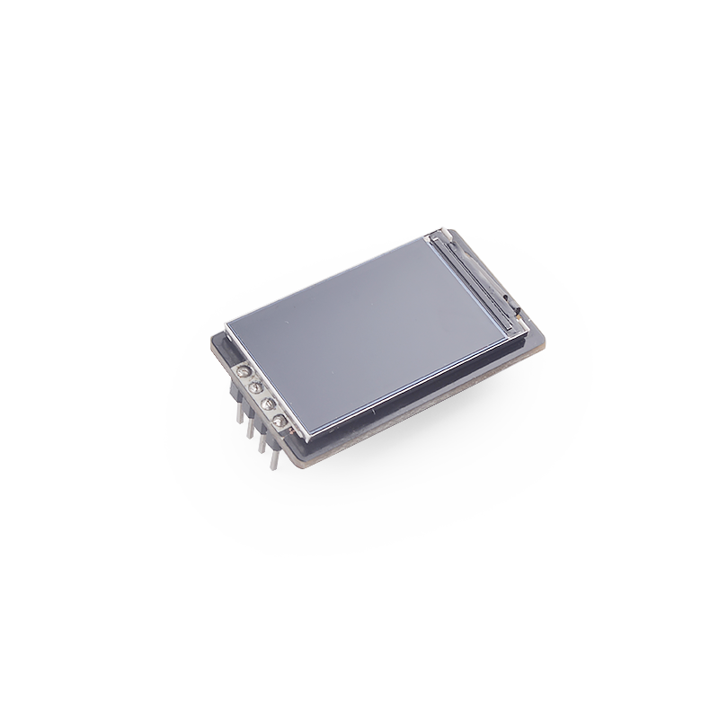

# SP_LCD-1.14 模块使用说明

[English](README.md)

## 介绍

SP_LCD 拥有一块1.14’寸 LCD，4 线 SPI 接口控制，8P FPC(0.5mm 间距)接口的 TFT 液晶屏，180°可视角，SP_MOD 连接方式。



*查看[模块规格书](doc/SP-LCD1.14规格书V1.0.pdf)获取更多特性信息*

## 接线方式


|   MCU:FUN(IO)   | SP_LCD |
| :-------------: | :----: |
|  GPIOHS7(IO_7)  |  RST   |
| GPIOHS15(IO_15) |  D/C   |
| SPI:SS0(IO_20)  |   CS   |
| SPI:SCK(IO_21)  |  SCK   |
| SPI:MOSI(IO_8)  |   SI   |
|  GPIOHS6(IO_6)  |   BL   |
|    2.5~4.8V     |  3.3V  |
|       GND       |  GND   |

## 引脚图


## MCU 配置

### IO 口配置

将 MCU 原理图对应的 IO 口配置为 SPI 功能引脚。

* C 示例

  ```c
  fpioa_set_function(SPI_IPS_LCD_CS_PIN_NUM, FUNC_SPI1_SS0);   // SPI_IPS_LCD_CS_PIN_NUM: 20;
  fpioa_set_function(SPI_IPS_LCD_SCK_PIN_NUM, FUNC_SPI1_SCLK); // SPI_IPS_LCD_SCK_PIN_NUM: 21;
  fpioa_set_function(SPI_IPS_LCD_MOSI_PIN_NUM, FUNC_SPI1_D0);  // SPI_IPS_LCD_MOSI_PIN_NUM: 8;
  fpioa_set_function(SPI_IPS_LCD_DC_PIN_NUM, FUNC_GPIOHS0 + SPI_IPS_LCD_DC_GPIO_NUM);   // SPI_IPS_LCD_DC_PIN_NUM: 15; SPI_IPS_LCD_DC_GPIO_NUM: 15;
  fpioa_set_function(SPI_IPS_LCD_RST_PIN_NUM, FUNC_GPIOHS0 + SPI_IPS_LCD_RST_GPIO_NUM); // SPI_IPS_LCD_RST_PIN_NUM: 7; SPI_IPS_LCD_RST_GPIO_NUM: 7;
  fpioa_set_function(SPI_IPS_LCD_BL_PIN_NUM, FUNC_GPIOHS0 + SPI_IPS_LCD_BL_GPIO_NUM);   // SPI_IPS_LCD_BL_PIN_NUM: 6; SPI_IPS_LCD_BL_GPIO_NUM: 6;
  
  // set gpiohs work mode to output mode
  gpiohs_set_drive_mode(SPI_IPS_LCD_DC_GPIO_NUM, GPIO_DM_OUTPUT);
  gpiohs_set_drive_mode(SPI_IPS_LCD_RST_GPIO_NUM, GPIO_DM_OUTPUT);
  gpiohs_set_drive_mode(SPI_IPS_LCD_BL_GPIO_NUM, GPIO_DM_OUTPUT);
  ```

* MaixPy 示例

  ```python
  # 20: SPI_IPS_LCD_SS_PIN_NUM;
  fm.register(20, fm.fpioa.GPIOHS20, force=True)
  # 15: SPI_IPS_LCD_DC_PIN_NUM;
  fm.register(15, fm.fpioa.GPIOHS15, force=True)
  # 6: SPI_IPS_LCD_BUSY_PIN_NUM;
  fm.register(6, fm.fpioa.GPIOHS6, force=True)
  # 7: SPI_IPS_LCD_RST_PIN_NUM;
  fm.register(7, fm.fpioa.GPIOHS7, force=True)
  
  # set gpiohs work mode to output mode
  cs = GPIO(GPIO.GPIOHS20, GPIO.OUT)
  dc = GPIO(GPIO.GPIOHS15, GPIO.OUT)
  busy = GPIO(GPIO.GPIOHS6, GPIO.OUT)
  rst = GPIO(GPIO.GPIOHS7, GPIO.OUT)
  ```

### SPI 初始化

* C 示例

  ```c
  spi_init(1, SPI_WORK_MODE_0, SPI_FF_STANDARD, DATALENGTH, 0);
  ```

* MaixPy 示例

  ```python
  spi1 = SPI(SPI.SPI1, mode=SPI.MODE_MASTER, baudrate=600 * 1000,
                 polarity=0, phase=0, bits=8, firstbit=SPI.MSB, sck=21, mosi=8)
  # 21: SPI_IPS_LCD_SCK_PIN_NUM; 8: SPI_IPS_LCD_MOSI_PIN_NUM;
  ```
  
  其他部分引脚在spi初始化时配置

## SP_LCD-1.14 配置

### 使用方式

* 流程

  1. 初始化配置
  2. 创建 image 并填充图像
  3. 发送图像

* C 示例

  ```c
  ips_lcd_init(); // init
  LCD_ShowPicture(0, 0, LCD_W, LCD_H, gImage_nanke); // display
  ```
  
* MaixPy 示例

  主要是配置其需要使用的 SPI，屏幕的宽和高（240/135两个数为最大），IPS_MODE 则是用来决定屏幕的方向，0/1为水平，2/3为竖直。

  ```python
  # init
  ips = SpiIps(spi1, cs, dc, rst, busy, IPS_WIDTH, IPS_HEIGHT, IPS_MODE)
  ips.init()
  
  # create an 'image' and fill it
  img = image.Image()
  img.draw_line(0, 0, 100, 100)
  img.draw_circle(50, 50, 20)
  img.draw_rectangle(80, 80, 30, 30)
  img.draw_circle(70, 70, 8)
  img.draw_circle(70, 160, 15)
  img.draw_circle(170, 70, 8)
  img.draw_circle(110, 40, 15)
  
  # display
  ips.display(img)
  ```

## 运行环境

|  语言  |  开发板  |          SDK/固件版本          |
| :----: | :------: | :----------------------------: |
|   C    | MaixCube | kendryte-standalone-sdk v0.5.6 |
| MaixPy | MaixCube |         maixpy v0.5.1          |

## 运行结果

* C

  

* MaixPy

  

## 许可

请查看 [LICENSE](LICENSE.md) 文件.

## 相关信息

| 版本号 |   编辑人   |
| :----: | :--------: |
|  v0.1  | vamoosebbf |
