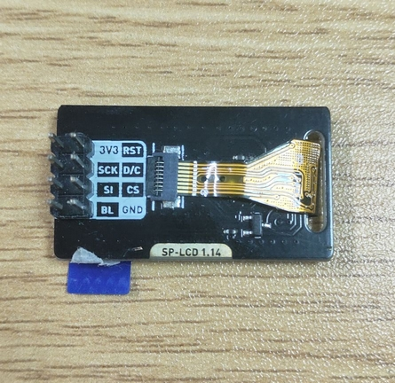
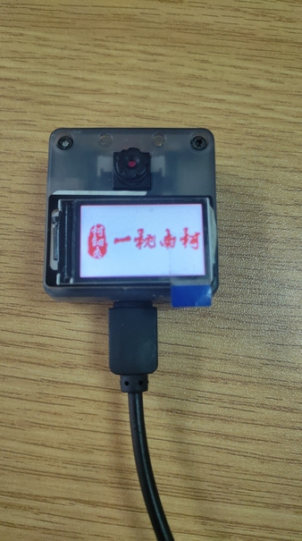
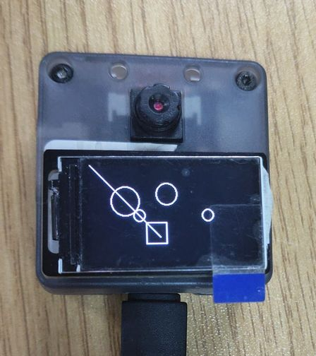

# SP_LCD-1.14 Module User Giude

[中文](READMD.md)

## Introduce

SP_LCD has a 1.14 'inch LCD, 4-line SPI interface control, 8P FPC(0.5mm interval) interface TFT LCD, 180° Angle of view, using SP_MOD connection.


*See [Module Spacification](doc/SP-LCD1.14 规格书 V1.0.pdf) for more information*

## Mode of connection

|   MCU    | SP_EINK |
| :------: | :-----: |
|   RES    |   RES   |
|   D/C    |   D/C   |
|    CS    |   CS    |
|   SCK    |   SCK   |
|   MOSI   |   SI    |
|   BSY    |   BSY   |
| 2.5-4,8V |  3.3V   |
|   GND    |   GND   |

## Pin figure



## MCU configuration

### IO port configuration

Configure IO port corresponding to MCU as SPI function pin.

* C

  ```c
  fpioa_set_function(SPI_IPS_LCD_CS_PIN_NUM, FUNC_SPI1_SS0);   // CS
  fpioa_set_function(SPI_IPS_LCD_SCK_PIN_NUM, FUNC_SPI1_SCLK); // SCLK
  fpioa_set_function(SPI_IPS_LCD_MOSI_PIN_NUM, FUNC_SPI1_D0);  // MOSI
  
  fpioa_set_function(SPI_IPS_LCD_DC_PIN_NUM, FUNC_GPIOHS0 + SPI_IPS_LCD_DC_GPIO_NUM);   // D2
  fpioa_set_function(SPI_IPS_LCD_RST_PIN_NUM, FUNC_GPIOHS0 + SPI_IPS_LCD_RST_GPIO_NUM); // D3
  fpioa_set_function(SPI_IPS_LCD_BL_PIN_NUM, FUNC_GPIOHS0 + 			 SPI_IPS_LCD_BL_GPIO_NUM);   // D2
  
  gpiohs_set_drive_mode(SPI_IPS_LCD_DC_GPIO_NUM, GPIO_DM_OUTPUT);
  gpiohs_set_drive_mode(SPI_IPS_LCD_RST_GPIO_NUM, GPIO_DM_OUTPUT);
  gpiohs_set_drive_mode(SPI_IPS_LCD_BL_GPIO_NUM, GPIO_DM_OUTPUT);
  
  gpiohs_set_pin(SPI_IPS_LCD_DC_GPIO_NUM, GPIO_PV_HIGH);
  gpiohs_set_pin(SPI_IPS_LCD_RST_GPIO_NUM, GPIO_PV_HIGH);
  gpiohs_set_pin(SPI_IPS_LCD_BL_GPIO_NUM, GPIO_PV_HIGH);
  ```

* MaixPy

  ```python
  # define SPI_IPS_LCD_SS_PIN_NUM 20
  fm.register(20, fm.fpioa.GPIOHS20, force=True)
  # define SPI_IPS_LCD_DC_PIN_NUM 15
  fm.register(15, fm.fpioa.GPIOHS15, force=True)
  # define SPI_IPS_LCD_BUSY_PIN_NUM 6
  fm.register(6, fm.fpioa.GPIOHS6, force=True)
  # define SPI_IPS_LCD_RST_PIN_NUM 7
  fm.register(7, fm.fpioa.GPIOHS7, force=True)
  
  cs = GPIO(GPIO.GPIOHS20, GPIO.OUT)
  dc = GPIO(GPIO.GPIOHS15, GPIO.OUT)
  busy = GPIO(GPIO.GPIOHS6, GPIO.OUT)
  rst = GPIO(GPIO.GPIOHS7, GPIO.OUT)
  ```

### SPI initialization

* C

  ```c
  spi_init(1, SPI_WORK_MODE_0, SPI_FF_STANDARD, DATALENGTH, 0);
  ```

* MaixPy

  ```python
  spi1 = SPI(SPI.SPI1, mode=SPI.MODE_MASTER, baudrate=600 * 1000,
                 polarity=0, phase=0, bits=8, firstbit=SPI.MSB, sck=21, mosi=8)
  ```

## SP_LCD-1.14 configuration

### Usage

* Process

  1. Initialization
  2. Create an image an fill it
  3. Send the image data

* C

  ```c
  ips_lcd_init();
  ips_lcd_color_bar_test();
  LCD_ShowPicture(0, 0, LCD_W, LCD_H, gImage_nanke);
  ```

* MaixPy

  It is mainly used to configure the SPI it needs. The width and height of the screen (240/135 is the maximum value), IPS_MODE is used to set the direction of the screen, 0/1 is horizontal, and 2/3 is vertical.

  ```python
  ips = SpiIps(spi1, cs, dc, rst, busy, IPS_WIDTH, IPS_HEIGHT, IPS_MODE)
  ips.init()
  
  img = image.Image()
  img.draw_line(0, 0, 100, 100)
  img.draw_circle(50, 50, 20)
  img.draw_rectangle(80, 80, 30, 30)
  img.draw_circle(70, 70, 8)
  img.draw_circle(70, 160, 15)
  img.draw_circle(170, 70, 8)
  img.draw_circle(110, 40, 15)
  
  print('ips test')
  
  ips.display(img)
  ```

## Runtime environments

| Language |  Boards  |      SDK/Firmware version      |
| :------: | :------: | :----------------------------: |
|    C     | MaixCube | kendryte-standalone-sdk v0.5.6 |
|  MaixPy  | MaixCube |         maixpy v0.5.1          |

## Result

* C

  

* MaixPy

  

## LICENSE

See [LICENSE](LICENSE.md) file.

## Other information

| Version |    Editor    |
| :-----: | :----------: |
|  v0.1   | Fang Qiurong |
